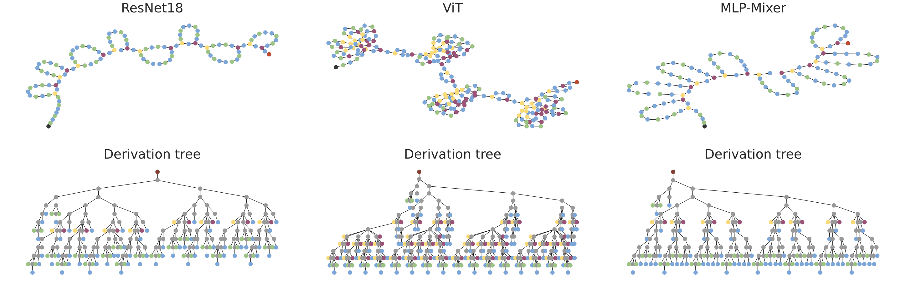

# `einspace`: Searching for Neural Architectures from Fundamental Operations

This is the official codebase for `einspace`, a new expressive search space for neural architecture search.



Diverse architectures can be represented in our expressive space. For more info, view our [project page](https://linusericsson.github.io/einspace/).

Follow the instructions below to set up the environment, data, and then run an example script.

### Environment Setup
We provide a sample setting up script as following:

```shell
conda create -n einspace python=3.10 -y
source activate einspace
pip install torch==1.13.1+cu117 torchvision==0.14.1+cu117 -f https://download.pytorch.org/whl/torch_stable.html
pip install git+https://github.com/SamsungLabs/zero-cost-nas.git
pip install tqdm scipy einops positional_encodings seaborn sympy h5py librosa
pip install -r requirements.txt
pip install -e .
```

### Data Setup
Please follow the official instructions of [UnseenNAS](https://github.com/Towers-D/NAS-Unseen-Datasets?tab=readme-ov-file) and [NASBench360](https://github.com/rtu715/NAS-Bench-360) to setup the dataset, after which you can place the files using the following arrangement.
```
einspace
|--data
|   |--adinst
|   |  |__metadata, test_x.npy, test_y.npy ...
|   |--language
|   |  |__metadata, test_x.npy, test_y.npy ...
|   |--multnist
|   |  |__metadata, test_x.npy, test_y.npy ...
|   |--cifartile
|   |  |__metadata, test_x.npy, test_y.npy ...
|   |--gutenberg
|   |  |__metadata, test_x.npy, test_y.npy ...
|   |--isabella
|   |  |__metadata, test_x.npy, test_y.npy ...
|   |--geoclassing
|   |  |__metadata, test_x.npy, test_y.npy ...
|   |--chesseract
|   |  |__metadata, test_x.npy, test_y.npy ...
|   |--cifar100
|   |   |--cifar100_train.indices
|   |   |--cifar100_valid.indices
|   |   |__cifar-100-python
|   |      |--meta
|   |      |--train
|   |      |__test
|   |--NinaPro
|   |   |__label_test.npy, label_train.npy, label_val.npy, ninapro_test.npy, ninapro_train.npy, ninapro_val.npy
|   |--Spherical
|   |   |__s2_cifar100.gz, spherical_train.indices, spherical_valid.indices
|   |--darcyflow
|   |   |__piececonst_r421_N1024_smooth1.mat, piececonst_r421_N1024_smooth2.mat
|   |--cosmic
|      |--cosmic_test.pt
|      |--cosmic_train.pt
|      |--cosmic_valid.pt
|      |--npy_test  
|      |--npy_train  
|      |--test_dirs.npy  
|      |__train_dirs.npy
|_ ...
```


### Running Experiments
```shell
python einspace/main.py --config $config --device $GPU
```
For example, to execute the `RE(RN18)` experiment on the Language dataset, you can run
```shell
python einspace/main.py --config configs/language/re_language.yaml --device cuda:0
```


## Cite us!

```

@preprint {
    ericsson_einspace_2024,
    title = {einspace: Searching for Neural Architectures from Fundamental Operations},
    author = {Linus Ericsson and Miguel Espinosa Minano and Chenhongyi Yang and Antreas Antoniou and Amos Storkey and Shay B. Cohen and Steven McDonagh and Elliot J. Crowley},
    year = {2024},
}
```
